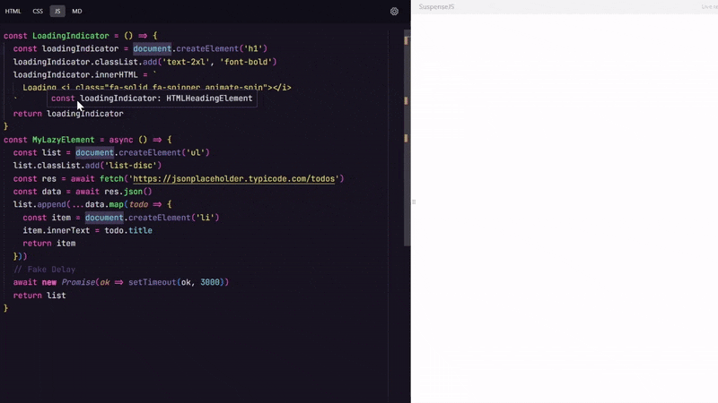

# 🚀 SuspenseJS - Vanilla JavaScript Suspense

**SuspenseJS** é uma implementação em **JavaScript Vanilla** do conceito de Suspense, inspirado no React. O projeto foi criado para demonstrar meu conhecimento em JavaScript e minha paixão por desenvolver soluções que aprimorem a experiência e a interação do usuário com interfaces mais eficientes e responsivas.

## 📚 Sobre o Projeto

No React, **Suspense** permite que componentes esperem pela resolução de promessas antes de serem renderizados, criando uma experiência de carregamento suave. O **SuspenseJS** traz esse conceito para o **JavaScript Vanilla**, oferecendo a mesma funcionalidade sem a necessidade de frameworks pesados, proporcionando mais controle e flexibilidade ao desenvolvedor.

## 🚀 Funcionalidades

- 🕒 **Carregamento Assíncrono**: SuspenseJS permite lidar com promessas de forma transparente, suspendendo a execução do código até que todos os dados necessários estejam disponíveis.
- ⚡ **Interface Fluida**: Melhora a experiência do usuário ao mostrar indicadores de carregamento enquanto os dados estão sendo processados.
- 💡 **Simples e Eficiente**: Desenvolvido usando apenas JavaScript puro, sem dependências externas, o que o torna rápido e leve para integração em qualquer projeto.
- 🔧 **Fácil de Usar**: A API é simples e intuitiva, facilitando sua adoção em projetos existentes ou novos.

## 🛠️ Instalação

Existem duas formas de utilizar o **SuspenseJS** em seu projeto:

### 1. **Usando CDN**

Você pode incluir **SuspenseJS** diretamente em seu projeto através da CDN do jsDelivr:

```html
<script src="https://cdn.jsdelivr.net/gh/MrNaceja/suspense-vanilla-js@master/dist/suspense.js"></script>
```

### 2. **Baixando o Código**

Você também pode baixar o código-fonte diretamente do repositório e incluir o arquivo JavaScript no seu projeto realizando as modificações necessárias.

## 🔨 Como usar


```js
const loadingIndicator = document.createElement("h1");
loadingIndicator.innerText = "Loading...";

const lazyListElement = async () => {
  const list = document.createElement("ul");
  try {
    const res = await fetch("url-data");
    const data = await res.json();

    list.append(
      ...data.map((value) => {
        const listItem = document.createElement("li");
        listItem.innerText = value;
        return listItem;
      })
    );
  } catch (e) {
    const errorMessage = document.createElement("p");
    errorMessage.innerText = e.message;
    return errorMessage;
  }
  return list;
};

Suspense({
  fallback: loadingIndicator,
  lazyElement: lazyListElement,
  target: document.body,
});
```

## 👨‍💻 Autor

Desenvolvido com ❤️ por Eduardo "Naceja" Toriani (MrNaceja) - apaixonado por JavaScript e interfaces de usuário. Sinta-se à vontade para entrar em contato!

## ✅ Gerar arquivo de distribuição CDN

> Utilizar comando npm run generate
